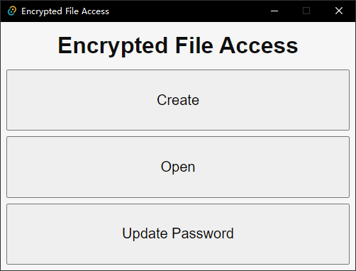
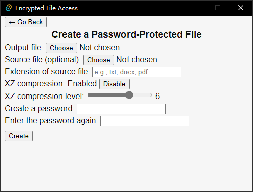
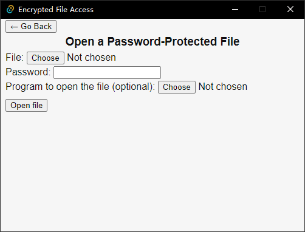
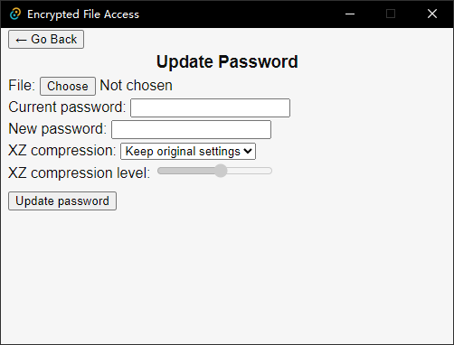

# Encrypted File Access GUI

This software provides a GUI for [Encrypted File Access](https://github.com/ccyuen1/encrypted-file-access) on desktop. Currently only tested on Windows.

## To-do list

- Navigate to the `CreatePage` by specifying a password-protected file as the first command line argument.
- Allow users to register this application in OS as a handler of password-protected files.

## Screenshots

## Acknowledgement

This software is built on top on [Encrypted File Access](https://github.com/ccyuen1/encrypted-file-access), [Tauri](https://tauri.app), [Vite](https://vitejs.dev), and [Vue](https://vuejs.org).
